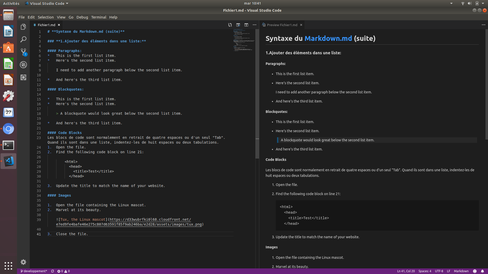

# Readme du project Markdown

## Qu’est-ce que c’est ?

Notre petit projet de groupe pour apprendre et synthétiser le markdown.

## Langage utilisé ?

- **Markdown**

## Que contient ce projet ?
### **Une synthese recapitulative en 2 parties**

[Partie 1](fichier1.md)  
[Partie 2](fichier2.md)
### **Un menu permettant de naviguer**

[Retour au Menu](Menu.md)

*projet par: Seb C / Seb P / Enzo / Fabien*

*Fait a becode le mardi 23 avril 2019*

